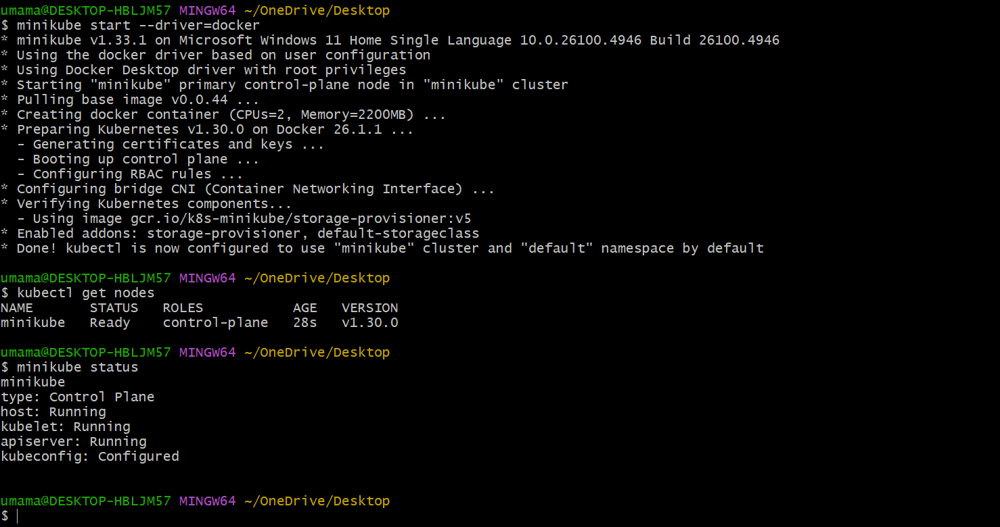

# GitOps with ArgoCD on Kubernetes

## Objective
Implement GitOps by syncing Kubernetes manifests directly from a GitHub repository using ArgoCD on Minikube.

---

## Tools
- Minikube / K3s  
- ArgoCD  
- Kubernetes  
- GitHub  
- Docker  

---

## INFRASTRUCTURE DIAGRAM
![Infra] (screenshots/Infrastructure.png)

---

## Steps

### 1. Start Minikube
Minikube cluster started using Docker driver.

---

### 2. Create ArgoCD Namespace & Install ArgoCD
Created `argocd` namespace and installed ArgoCD in the cluster using `kubectl apply`.

---

### 3. Access ArgoCD UI
Port-forward ArgoCD server and access via browser.  
**Note:** The browser may show "Not Secure" due to self-signed certificates. Click **Advanced → Proceed**.

---

### 4. Create Application Manifests
Deployment and Service manifests created for `nginx-demo` and pushed to GitHub.

**Application is `nginx-demo`**

---

### 5. Sync & Observe Changes
ArgoCD auto-syncs manifests from GitHub to Kubernetes.  
Example: Updated replicas from 1 → 2 in Git, ArgoCD automatically applied changes.

---

## Video Demo
Watch the GitOps workflow in action:

loom video: https://www.loom.com/share/f2a737a2a30d4e5c9c54bb504842f11b?sid=1a6e2d5b-b2c9-408f-b11b-902d838592a5

---

